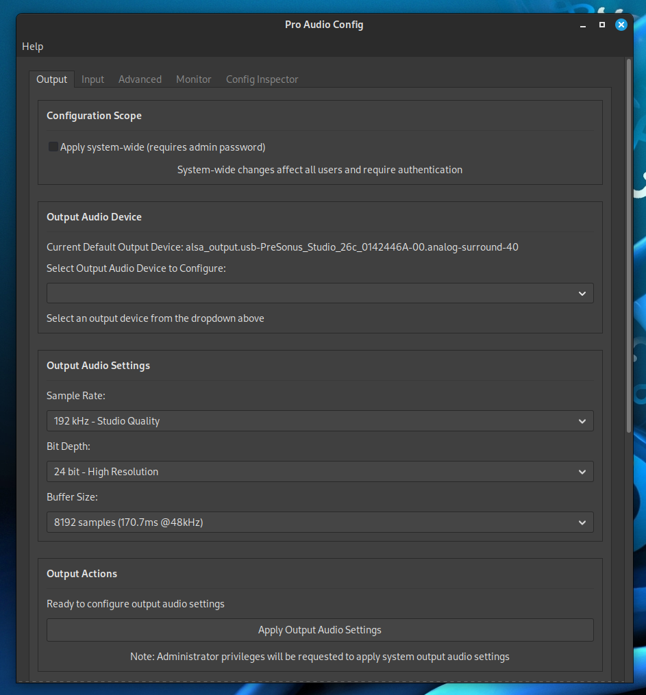

# Pro Audio Config

[](https://github.com/Peter-L-SVK/pro_audio_config/actions/workflows/rust-ci.yml)

A professional audio configuration tool for Linux systems that provides a simple graphical interface to manage PipeWire and ALSA audio settings. Finally, an easy way to configure sample rates, bit depths, and buffer sizes without digging through config files.

## Why This Exists

After 10 years of using Fedora and other Linux distributions, I realized we're still missing a fundamental tool: a simple, graphical way to configure professional audio settings. In 2025, manually editing configuration files shouldn't be the only option for adjusting basic audio parameters.

  
*(Program running)*

## Features

- **Device Detection**: Automatically detects and displays current audio devices (PipeWire, ALSA, PulseAudio)
- **Sample Rate Configuration**: Support for rates from 44.1 kHz to 384 kHz
- **Bit Depth Settings**: 16-bit, 24-bit, and 32-bit audio formats
- **Buffer Size Control**: Adjustable buffer sizes from 128 to 8192 samples
- **Professional Audio Support**: Optimized for studio and high-quality audio applications
- **Graphical Interface**: Clean, intuitive GTK-based user interface
- **No Terminal Required**: Graphical interface that anyone can use
- **Privilege Escalation**: Secure privilege escalation for system-level audio configuration

### Multi-Tab Interface
- **Separate Input/Output Configuration**: Dedicated tabs for playback (output) and recording (input) devices
- **Independent Settings Management**: Configure input and output devices with different sample rates, bit depths, and buffer sizes
- **Clear Visual Separation**: Intuitive tabbed interface that clearly distinguishes between recording and playback settings

### Configuration Scope
- **User-Specific Configuration**: Apply settings only for the current user (default)
- **System-Wide Configuration**: Apply settings for all users on the system (requires admin privileges)
- **Flexible Deployment**: Choose between user-specific or system-wide configuration based on your needs

### Advanced Configuration
- **Dedicated WirePlumber Configs**: Separate configuration generators for input vs output devices
- **Independent Signal Handlers**: Each tab manages its own settings and apply operations
- **Comprehensive Testing**: Extensive test suite covering new input/output separation features

## Supported Audio Systems

- PipeWire (primary)
- ALSA (fallback)
- PulseAudio (legacy support)

## Future Proof Design

This tool is designed to grow with PipeWire and Linux audio:

- **Extended buffer support** ready for future PipeWire versions
- **Modular architecture** for easy addition of new audio backends
- **Hardware-agnostic** - works with any ALSA-compatible device
- **Standards-based** using industry-standard audio formats
- **Extensible UI** that can accommodate new settings and features

As audio companies improve their Linux driver support and PipeWire continues to evolve, this tool will be ready to leverage those advancements immediately.

## Requirements

### System Dependencies
- PipeWire (recommended) or PulseAudio
- WirePlumber
- ALSA utilities
- pkexec (for privilege escalation)

### Rust Toolchain
- Rust 1.85.0 or newer
- Cargo

### GTK Development Libraries
- gtk3-devel (or equivalent for your distribution)

## Installation

### Quick Install
```bash
git clone https://github.com/Peter-L-SVK/pro-audio-config
cd pro-audio-config
./install.sh
```

### From Source

1. Clone the repository:
```bash
git clone https://github.com/Peter-L-SVK/pro-audio-config
cd pro_audio_config
```

2. Build and install:
```bash
cargo build --release
sudo cp target/release/pro-audio-config /usr/local/bin/
```

### Uninstall
```bash
./uninstall.sh
```

## Usage

### Graphical Interface
Run the application from your application menu or terminal:
```bash
pro-audio-config
```

### Input/Output Tabs
- **Output Tab**: Configure playback devices (speakers, headphones, HDMI outputs)
- **Input Tab**: Configure recording devices (microphones, audio interfaces, line inputs)

Each tab maintains independent settings, allowing you to optimize input and output devices separately for your specific use case.

### Configuration Scope
- **User-Specific (Default)**: Settings apply only to your user account, stored in `~/.config/pipewire/`
- **System-Wide**: Settings apply to all users, stored in `/etc/pipewire/` (requires authentication)
- **Toggle Option**: Use the "Apply system-wide" checkbox to switch between user and system configuration

## Configuration

### Sample Rates
- 44.1 kHz - CD Quality
- 48 kHz - Standard Audio
- 96 kHz - High Resolution
- 192 kHz - Studio Quality
- 384 kHz - Ultra High Resolution

### Bit Depths
- 16 bit - CD Quality
- 24 bit - High Resolution
- 32 bit - Studio Quality

### Buffer Sizes
- 128 samples (2.7ms @48kHz)
- 256 samples (5.3ms @48kHz)
- 512 samples (10.7ms @48kHz)
- 1024 samples (21.3ms @48kHz)
- 2048 samples (42.7ms @48kHz)
- 4096 samples (85.3ms @48kHz) 
- 8192 samples (170.7ms @48kHz)

## Building from Source

### Development Build
```bash
git clone https://github.com/Peter-L-SVK/pro-audio-config
cd pro_audio_config
cargo build
```

### Release Build
```bash
cargo build --release
```

### Running Tests
```bash
cargo test
```

## Project Structure

```
pro_audio_config/
├── src/
│   ├── main.rs          # Application entry point
│   ├── lib.rs           # Library definitions and exports
│   ├── audio.rs         # Audio device detection and settings
│   ├── config.rs        # PipeWire/WirePlumber configuration
│   ├── ui.rs            # GTK user interface with tabbed interface
│   └── utils.rs         # Utility functions
├── tests/
│   ├── integration.rs   # Main integration tests
│   ├── audio_integration.rs # Audio-specific integration tests
│   ├── ui_integration.rs    # UI integration tests
│   └── common.rs        # Test utilities
├── icons/               # Application icons (multiple sizes)
├── install.sh           # Installation script
├── uninstall.sh         # Uninstallation script
└── Cargo.toml           # Project dependencies
```

## Technical Details

### Architecture
- Frontend: GTK3 with Rust bindings
- Audio Backend: PipeWire with ALSA fallback
- Configuration: WirePlumber for session management
- Privilege Escalation: pkexec for secure root access
- Multi-threaded UI: Non-blocking device detection and configuration

### Configuration Scope Implementation
- **User Configuration**: Uses `~/.config/pipewire/pipewire.conf.d/` directory
- **System Configuration**: Uses `/etc/pipewire/pipewire.conf.d/` directory
- **Preference Persistence**: User preferences saved in `~/.config/pro-audio-config/preferences.toml`
- **Authentication**: Uses system's policy kit for secure privilege escalation

### Audio Format Mapping
- 16-bit: S16LE
- 24-bit: S24LE
- 32-bit: S32LE

### Configuration Approaches
- **Primary**: PipeWire config fragments (highest priority)
- **Fallback**: WirePlumber JSON configuration
- **Legacy**: WirePlumber Lua configuration (versions < 0.5)
- **Emergency**: Direct modification of main pipewire.conf

## Contributing

Contributions are welcome! Please feel free to submit pull requests, report bugs, or suggest new features.  

See [CONTRIBUTING](https://github.com/Peter-L-SVK/pro_audio_config/blob/main/CONTRIBUTING.md) file for details.  

For contact please see my email in profile info or use GitHub's built-in communication tools.

Please open an issue or pull request for any:  

- Bug fixes
- Feature suggestions
- Documentation improvements

### Development Setup
1. Fork the repository
2. Create a feature branch
3. Make your changes
4. Run tests: `cargo test`
5. Submit a pull request

### Testing
Ensure all tests pass before submitting changes:
```bash
cargo test --lib
cargo test --tests
```

## License

This project is licensed under the MIT License - see the LICENSE file for details.

## Support

For support and questions:
- Open an issue on GitHub
- Check the documentation
- Review existing issues for similar problems

## Roadmap

- [ ] Package manager support (RPM/DEB/Flatpak)
- [x] Setting all available devices in one session
- [x] Separate input/output configuration tabs
- [x] User vs system-wide configuration scope
- [ ] Additional audio backends (JACK)
- [ ] Preset configurations
- [ ] Advanced audio routing
- [ ] Real-time audio monitoring

## Acknowledgments

- PipeWire developers for the modern audio system
- GTK team for the GUI toolkit
- Rust community for excellent libraries and tools

---
**Stop fighting config files. Start making great audio.**
