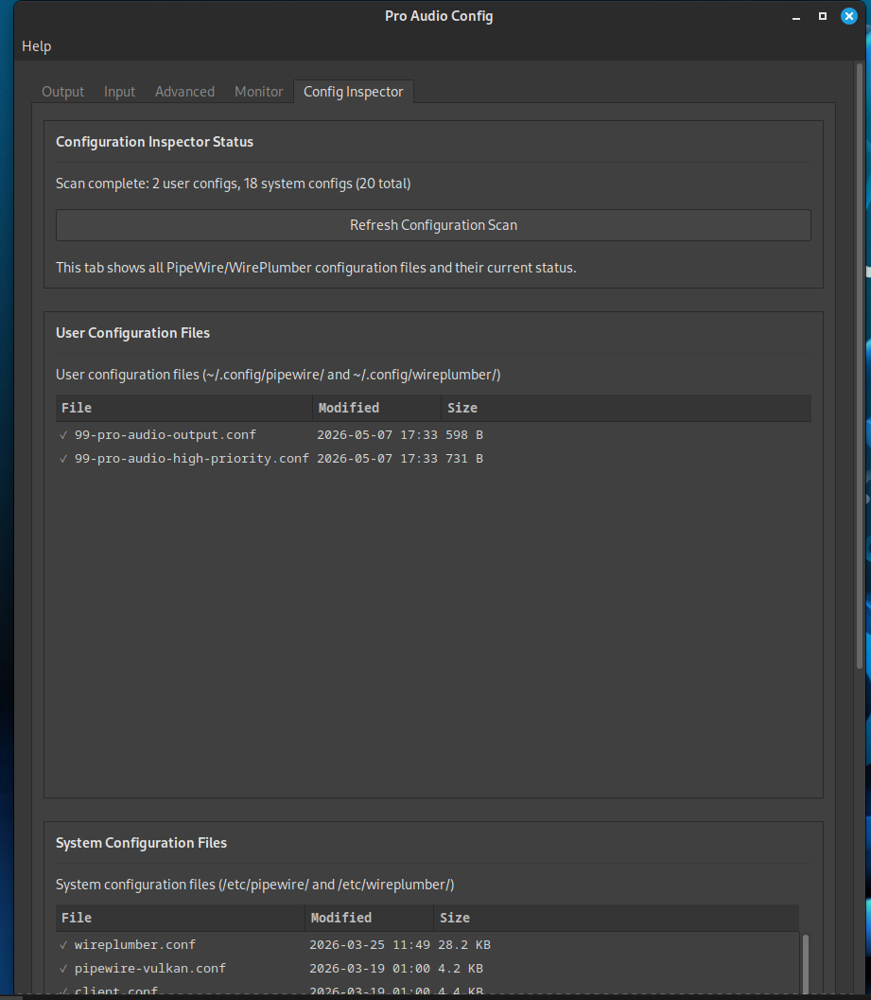
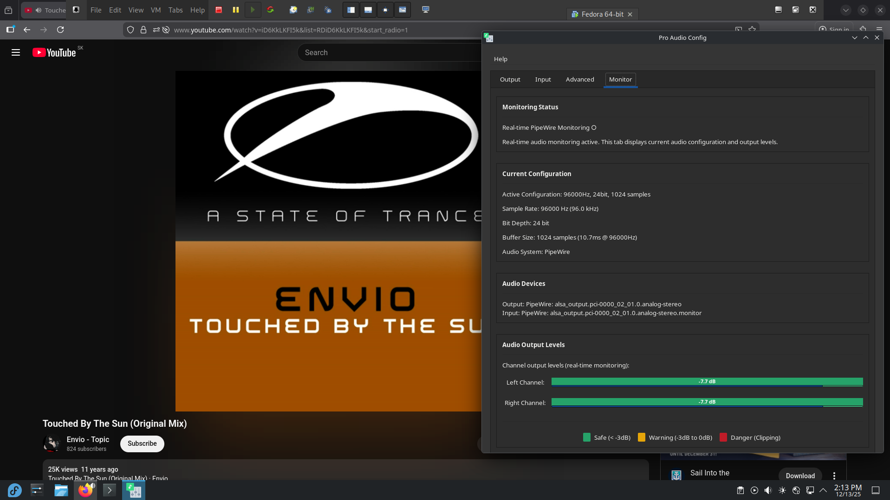
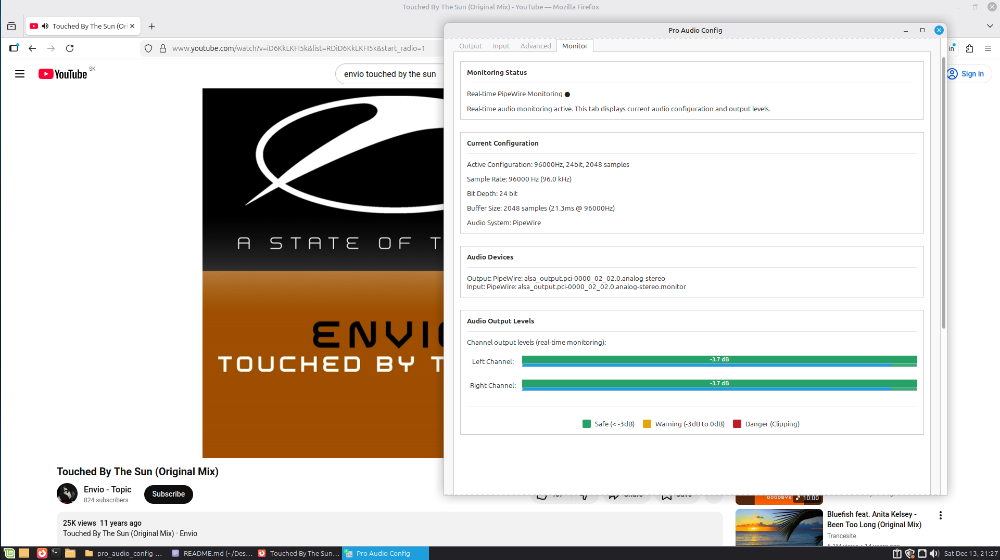
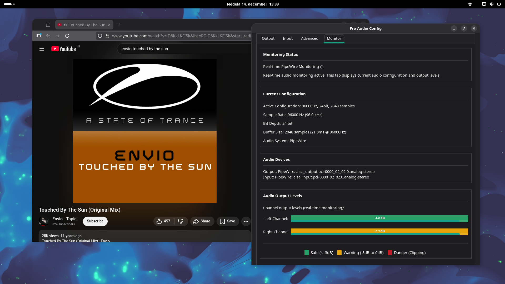
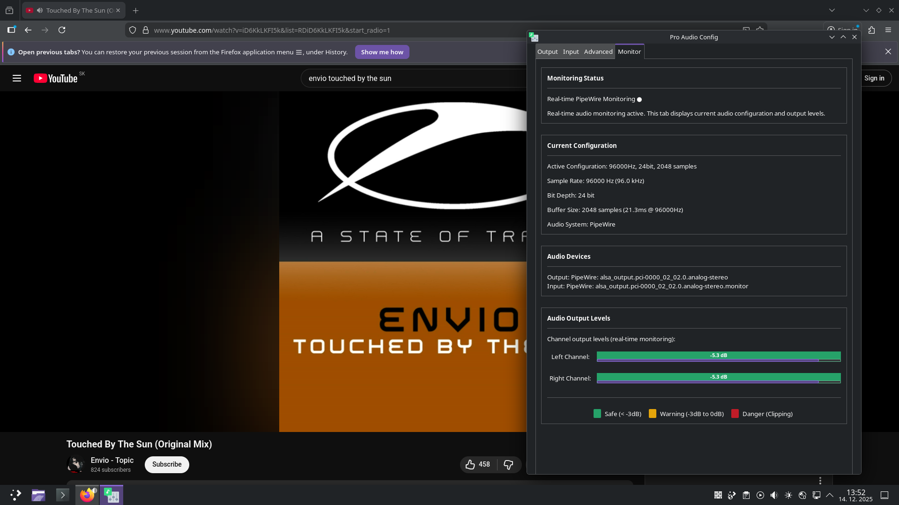

# Gallery

  
*(Default output selected)*  

  
*(Default input selected)*  

  
*(Advanced global mode config)*  

  
*(Advanced global mode pro config)*  

  
*(Advanced mode app exclusive config)*  

  
*(Advanced mode app exclusive config)*  

  
*(In the task manager)*  

  
*(Monitoring)*  

  
*(Config Inspector)*  

  
*(Running program in VM Ware on Fedora Jam with KDE Plasma 6.5 "dark breeze" theme)*  
About Feadora jam - [Fedora Jam](https://www.fedoraproject.org/labs/jam)

  
*(Running program in VM Ware on Mint 22.2 Zara MATE default theme)*  

  
*(Running program in VM Ware on Manajaro Gnome 49 default theme)*  

  
*(Running program in VM Ware on EndeavourOS Ganymede KDE Plasma 6.5 default theme)*  

  
*(Help -> About)*  

  
*(License)*  

---
