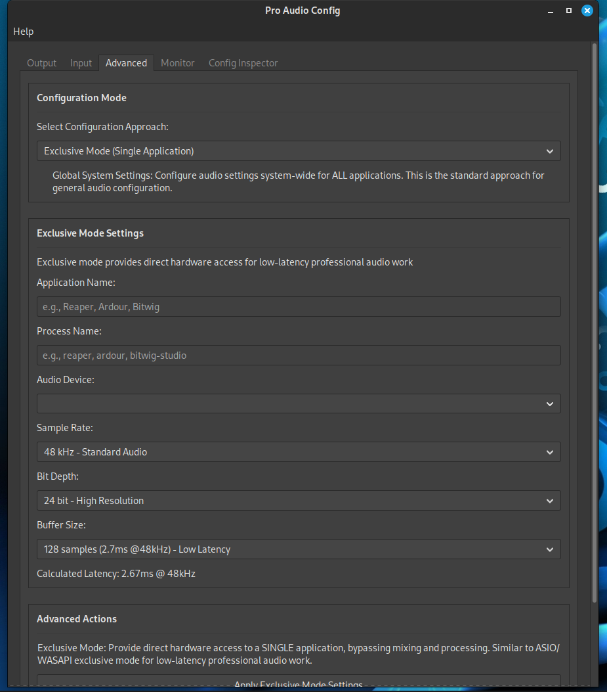
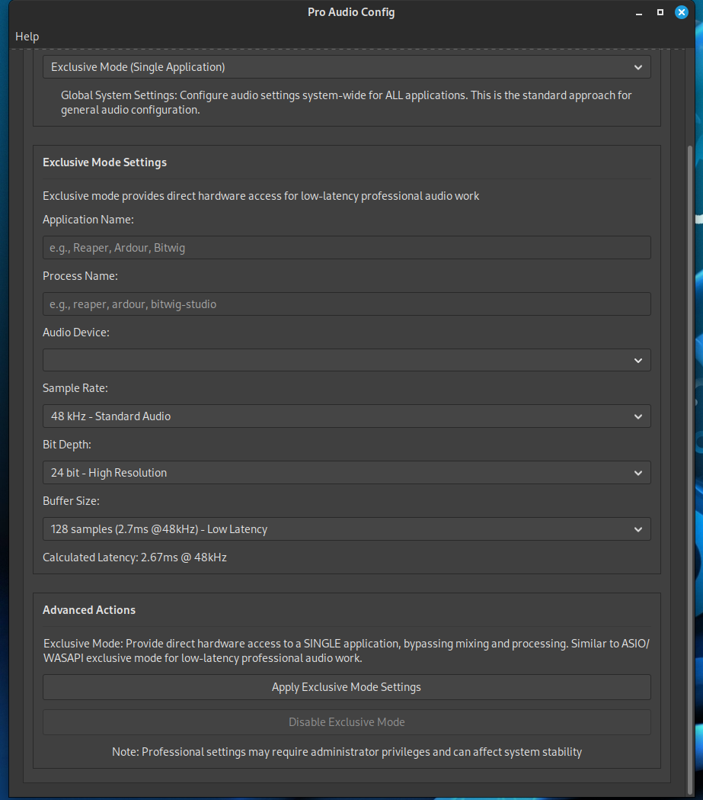
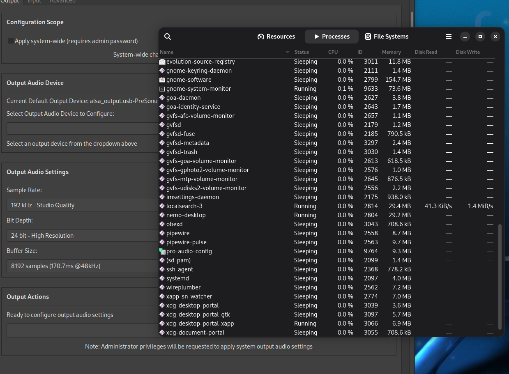
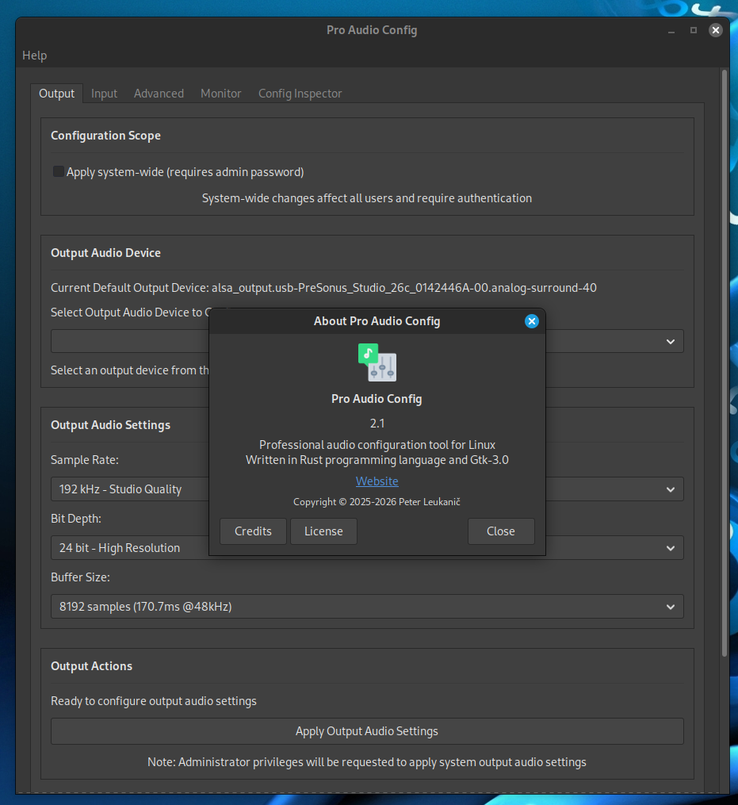
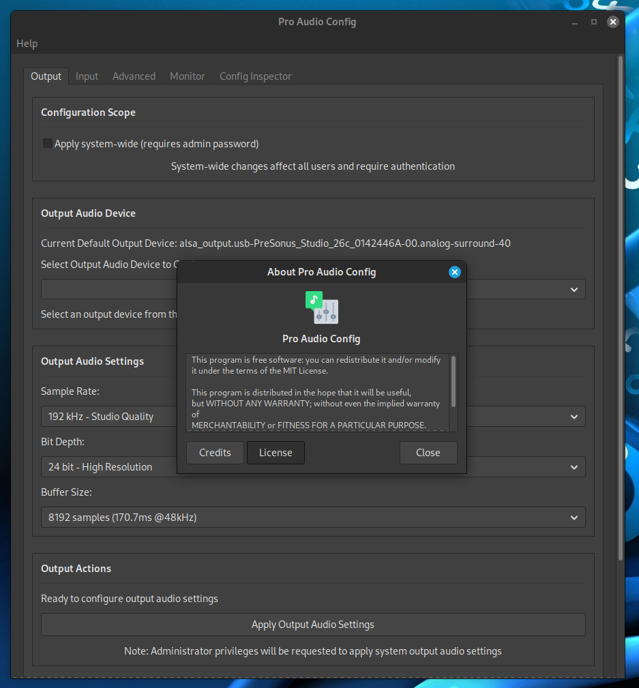

# Gallery

  
*(Default output selected)*  

  
*(Default input selected)*  

  
*(Advanced global mode config)*  

  
*(Advanced global mode pro config)*  

  
*(Advanced mode app exclusive config)*  

  
*(Advanced mode app exclusive config)*  

  
*(In the task manager)*  

  
*(Help -> About)*  

  
*(License)*  

---
